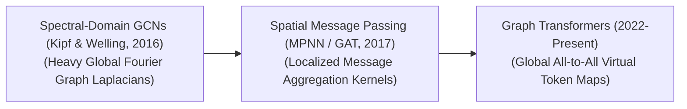

# Awesome-GNNs
## Graph Neural Networks (GNNs): History, Progression, Variants, & Applications

Graph Neural Networks (GNNs) represent a monumental shift in deep learning, expanding neural network capabilities from structured grids (like 1D text text sequences or 2D image pixels) to complex, non-Euclidean data topologies. Graphs model entities (nodes) and their relationships (edges) dynamically, making them ideal for representing molecular connections, social networks, financial transaction webs, and knowledge databases. By utilizing message-passing frameworks, GNNs propagate node features iteratively across neighboring structures, allowing the network to capture both localized entity attributes and global geometric patterns simultaneously.

---

## 1. The Macro Chronological Evolution

The technical progression of graph-based deep learning reflects a clear shift from rigid spectral domain calculus to localized spatial message-passing and modern scalable transformer-hybrid structures.

| Era / Paradigm | Year | Paper | Details |
| :--- | :--- | :--- | :--- |
| **The Spectral Domain Era (~2013–2016)** | 2013 | [Spectral Networks](https://arxiv.org/abs/1312.6203) (Bruna et al., 2013) / [GCN](https://arxiv.org/abs/1609.02907) (Kipf & Welling, 2016) | **Concept:** The theoretical foundation. Early GNNs defined graph convolutions by migrating to the spectral domain using the **Graph Laplacian** and Fourier transforms. Kipf and Welling modernized this with the **Graph Convolutional Network (GCN, 2016)**, using a localized first-order Chebyshev polynomial approximation. **Limitation:** Computationally unscalable. Spectral methods require computing or approximating eigenvectors over the entire global graph topology, collapsing if a single new node joins or alters the network structure. |
| **The Spatial Message-Passing & Attention Era (~2017–2021)** | 2017 | [MPNN](https://arxiv.org/abs/1704.01212) (Gilmer et al., 2017) / [GAT](https://arxiv.org/abs/1710.10903) (Veličković et al., 2017) | **Concept:** Resolved the scaling crisis by shifting convolutions straight onto the graph's physical space. Gilmer et al. unified this via **Message Passing Neural Networks (MPNNs)**, framing updates as a three-step localized pipeline: *Send Message*, *Aggregate*, and *Update Node Hidden State*. This peaked with the **Graph Attention Network (GAT, 2017)**, which used anisotropic self-attention coefficients to weigh individual neighbor contributions dynamically. **Significance:** Transformed GNNs into highly localized operators. It enabled models to process dynamic, shifting graphs natively while dropping training time and memory complexities dramatically. |
| **The Graph Transformer & Foundational Scale Era (~2022–Present)** | 2021 | [Graphormer](https://arxiv.org/abs/2106.05234) (Ying et al., 2021) | **Concept:** The current modern state-of-the-art paradigm. Traditional spatial GNNs suffer from structural boundaries like "oversmoothing" when stacked past a few layers. Graph Transformers (e.g., GraphFormers, Graphormer) bypass message-passing completely. They treat nodes as independent virtual tokens inside a standard global Multi-Head Self-Attention core, injecting **Structural and Topological Encodings** (such as shortest-path distance or degree centralities) to maintain graph awareness. |

---

## 2. Core Algorithmic & Convolutional Variants

GNN architectures are strictly categorized based on how they extract, scale, and mathematically aggregate feature parameters across local neighborhood boundaries.

| Variant | Year | Paper | Details |
| :--- | :--- | :--- | :--- |
| **A. Graph Convolutional Networks (GCN)** | 2016 | [GCN](https://arxiv.org/abs/1609.02907) (Kipf & Welling, 2016) | **Mechanism:** Isotropic spatial operator. It computes a localized forward-pass update by taking a normalized average of a target node's immediate neighborhood features, scaling them via a static degree matrix. **Pros:** Computationally lightweight, but cannot differentiate the relative structural importance of one neighbor over another. |
| **B. Graph Attention Networks (GAT)** | 2017 | [GAT](https://arxiv.org/abs/1710.10903) (Veličković et al., 2017) | **Mechanism:** Anisotropic attention-driven operator. It projects query vectors from a target node against key vectors from adjacent neighbors, applying a Softmax normalization to calculate dynamic weighting scalars. **Pros:** Allows the network to learn to selectively ignore noisy connections while amplifying critical relational feature pathways. |
| **C. GraphSAGE (Sample and Aggregate)** | 2017 | [GraphSAGE](https://arxiv.org/abs/1706.02216) (Hamilton et al., 2017) | **Mechanism:** Inductive mini-batch neighborhood pooling framework. Instead of reading an entire localized neighborhood matrix, it uniformly samples a fixed-capacity subset of neighbors (e.g., max 10 nodes) at each layer step, running aggregation functions like Max-Pooling or LSTMs. **Significance:** Crucial for scaling GNNs to massive web-scale industrial graphs (like billions of user profiles), decoupling memory footprint explosion from dense node connectivity boundaries. |
| **D. Graph Isomorphism Networks (GIN)** | 2018 | [GIN](https://arxiv.org/abs/1810.00826) (Xu et al., 2018) | **Mechanism:** A highly powerful, theoretical expressiveness baseline developed by Xu et al. It proves mathematically that standard GCN and GAT models cannot distinguish certain distinct graph structures (like multi-branch trees). GIN fixes this by deploying injective aggregation functions (such as sum-pooling mapped via multi-layer perceptrons). **Significance:** Achieves maximal discriminatory capability, matching the theoretical ceiling of the **1-Weisfeiler-Lehman (1-WL) graph isomorphism test**. |

---

## 3. The Core Graph Task Hierarchy

GNN optimization pipelines are targeted at distinct operational checkpoints depending on the scale of the business analysis matrix.

| Task Level | Year | Paper | Details |
| :--- | :--- | :--- | :--- |
| **Node-Level Classification** | 2008 | [GNN Model](https://ieeexplore.ieee.org/document/4703180) (Scarselli et al., 2008) | **Task:** Categorizing individual entities. The model evaluates a node's combined spatial features to predict its target class. **Example:** Detecting fraudulent accounts or bot profiles within a social media connection web. |
| **Edge-Level Link Prediction** | 2018 | [SEAL](https://arxiv.org/abs/1802.09691) (Zhang & Chen, 2018) | **Task:** Relationship forecasting. The network calculates a distance or similarity score between the hidden states of two separate nodes, predicting the likelihood that a connection exists or will form between them. **Example:** Powering e-commerce recommendation loops (e.g., predicting user-to-product edge weights). |
| **Graph-Level Global Regression** | 2017 | [MPNN](https://arxiv.org/abs/1704.01212) (Gilmer et al., 2017) | **Task:** Complete graph synthesis. The entire node feature matrix is squashed down into a single, global vector representation via a Readout pooling function to output a macro score. **Example:** Simulating a complete chemical molecule to instantly predict its toxicity, binding affinity, or physical boiling point. |

---

## 4. Production Engineering Challenges & Hardware Solutions

Deploying large-scale graph structures across commercial computing infrastructure introduces unique memory-bus and communication bottlenecks.

| Production Challenge | Year | Paper | Details |
| :--- | :--- | :--- | :--- |
| **The "Neighborhood Explosion" Memory Wall** | 2019 | [Cluster-GCN](https://arxiv.org/abs/1905.07953) (Chiang et al., 2019) | **Problem:** Because spatial message-passing cascades across successive layers, calculating gradients over a deep 4-layer GNN forces the model to read an exponentially expanding tree of historical nodes (the neighborhood explosion). This quickly saturates VRAM during batch training sweeps, triggering system crashes. **Mitigation:** Implementing **Sub-graph Partitioning algorithms** (like Cluster-GCN) or **Node-Sampling frameworks** (like GraphSAGE), sharding massive structural graphs into small, dense, and self-contained computational matrix tiles. |
| **The Oversmoothing and Oversquashing Stagnation** | 2020 | [DropEdge](https://arxiv.org/abs/1907.10903) (Rong et al., 2020) | **Problem:** When stacking standard spatial message-passing blocks past 4 to 8 layers, the constant averaging of neighbor parameters causes all node hidden vectors to converge on identical numerical states (Oversmoothing), rendering feature separation impossible. **Mitigation:** Implementing **DropEdge parameters** (randomly deleting fractioned edges during training to enforce structural sparsity), layering residual skip connections, or migrating straight to **Graph Transformer architectures**. |

---

## 5. Frontier Real-World Industrial Applications

| Industrial Application | Year | Paper | Details |
| :--- | :--- | :--- | :--- |
| **De Novo Molecular Docking & Protein-Folding Synthesis (BioTech)** | 2021 | [AlphaFold](https://www.nature.com/articles/s41586-021-03819-2) (Jumper et al., 2021) | **Application:** Accelerates target-specific drug discovery loops. Models like AlphaFold and related graph architectures treat molecular chemical bonds natively as edge variables and atoms as node nodes. GNN layers parse 3D geometric configurations, optimizing properties to discover stable therapeutic compounds rapidly. |
| **Enterprise Financial Fraud & Money Laundering Interception** | 2019 | [AML Bitcoin GCN](https://arxiv.org/abs/1907.13222) (Weber et al., 2019) | **Application:** Screens millions of high-frequency banking streams continuously. Anti-Money Laundering (AML) pipelines build dynamic transaction graphs where nodes represent accounts and edges trace fund transfers. Link prediction and node classification GNNs intercept hidden shell-company cycles and multi-hop laundering routing vectors in real time before execution. |
| **Scale-Invariant E-Commerce Recommendation & Knowledge Graphs** | 2018 | [PinSage](https://arxiv.org/abs/1806.01973) (Ying et al., 2018) / [Pixie](https://arxiv.org/abs/1711.07601) (Eksombatchai et al., 2018) | **Application:** Powers high-volume consumer personalization arrays (such as Pinterest's Pixie engine or Amazon product routers). Massive distributed GraphSAGE pipelines process user-interaction nodes, mapping real-time browse histories to dynamic item graphs to output accurate user affinity indices instantly. |

---

## References
1. Kipf, T. N., & Welling, M. (2016). Semi-supervised classification with graph convolutional networks. *arXiv preprint arXiv:1609.02907*.
2. Gilmer, J., et al. (2017). Neural message passing for quantum chemistry. *International Conference on Machine Learning (ICML)*, 1263-1272.
3. Veličković, P., et al. (2017). Graph attention networks. *arXiv preprint arXiv:1710.10903*.
4. Hamilton, W., Ying, Z., & Leskovec, J. (2017). Inductive representation learning on large graphs. *Advances in Neural Information Processing Systems (NeurIPS)*, 30.
5. Xu, K., et al. (2018). How powerful are graph neural networks?. *arXiv preprint arXiv:1810.00826*.
6. Ying, R., et al. (2018). Graph convolutional neural networks for web-scale recommender systems. *Proceedings of the 24th ACM SIGKDD International Conference on Knowledge Discovery & Data Mining*, 974-983.
7. Ying, C., et al. (2021). Do transformers really perform badly for graph representation?. *Advances in Neural Information Processing Systems (NeurIPS)*, 34, 28877-28888.

---

To advance your documentation repository, developmental pipeline, or setup orchestration workspace, consider pursuing these adjacent research tracks:
* Build a **Python script using PyTorch Geometric (PyG)** illustrating how to construct a basic Graph Attention Network (GAT) layer block including custom feature updates from scratch.
* Generate a **comprehensive Markdown table** explicitly comparing GCN, GAT, GraphSAGE, GIN, and Graph Transformers across time complexity bounds, mathematical aggregation metrics, inductive bias preservation, and target network structures.
* Establish a **distributed performance profiling suite using Triton** to track the exact computational throughput and memory compression improvements achieved when migrating graph message-passing operators from unstructured indexing to contiguous block-sparse matrices.

