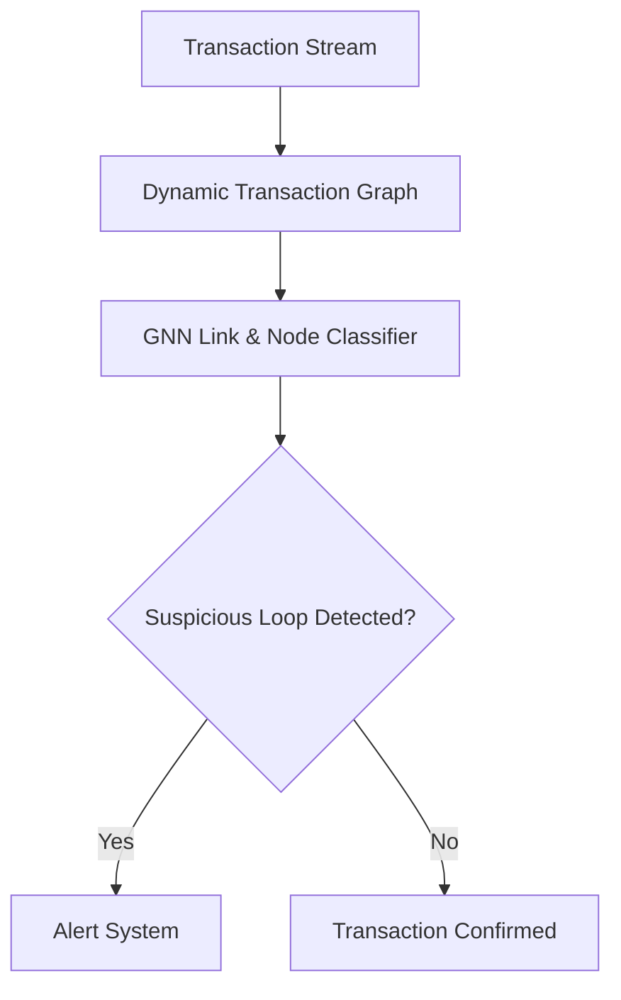

# Enterprise Financial Fraud & Money Laundering Interception

## Overview
Screens millions of high-frequency banking streams continuously. AML pipelines build dynamic transaction graphs where nodes represent accounts and edges trace fund transfers to intercept laundering routing vectors.

## Architecture Diagram

## Further Reading
- [Return to Main Index](../README.md)
