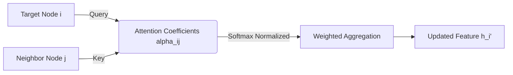

# Graph Attention Networks (GAT)

## Overview
Anisotropic attention-driven operator. It projects query vectors from a target node against key vectors from adjacent neighbors, applying a Softmax normalization to calculate dynamic weighting scalars.

## Architecture Diagram

## Further Reading
- [Return to Main Index](../README.md)
