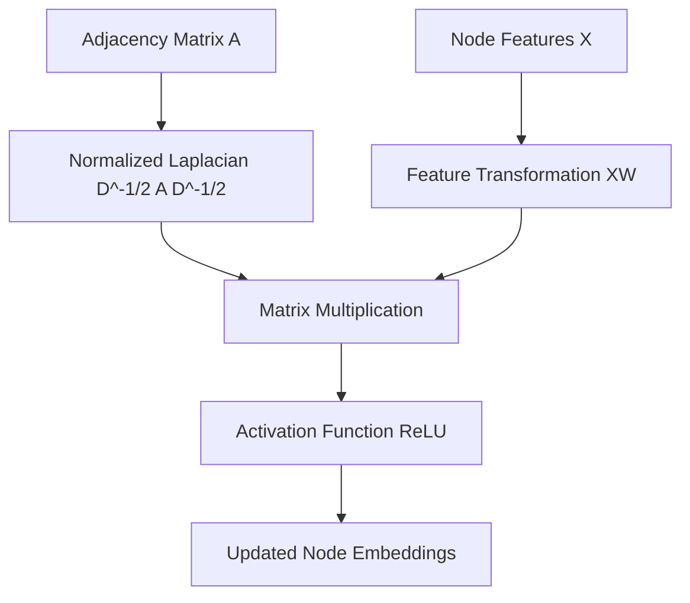

# Graph Convolutional Networks (GCN)

## Overview
Anisotropic isotropic spatial operator. It computes a localized forward-pass update by taking a normalized average of a target node's immediate neighborhood features, scaling them via a static degree matrix.

## Architecture Diagram

## Further Reading
- [Return to Main Index](../README.md)
