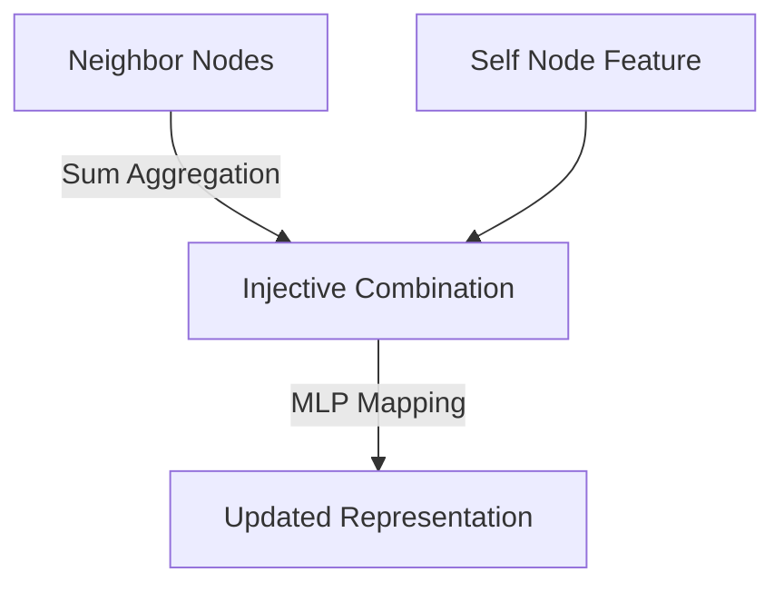

# Graph Isomorphism Networks (GIN)

## Overview
A highly powerful, theoretical expressiveness baseline developed by Xu et al. It proves mathematically that standard GCN and GAT models cannot distinguish certain distinct graph structures (like multi-branch trees). GIN fixes this by deploying injective aggregation functions (such as sum-pooling mapped via multi-layer perceptrons).

## Architecture Diagram

## Further Reading
- [Return to Main Index](../README.md)
