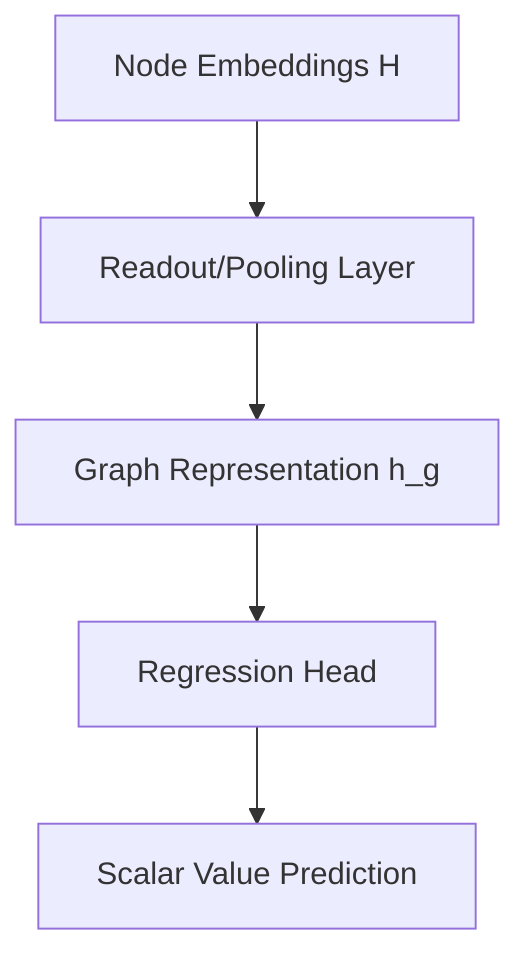

# Graph-Level Global Regression

## Overview
Complete graph synthesis. The entire node feature matrix is squashed down into a single, global vector representation via a Readout pooling function to output a macro score, such as simulating molecular properties.

## Architecture Diagram

## Further Reading
- [Return to Main Index](../README.md)
