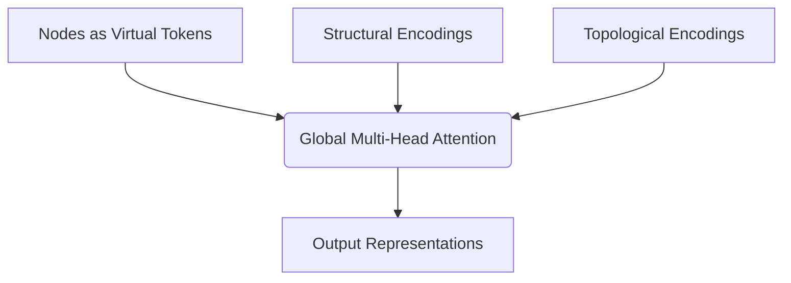

# The Graph Transformer & Foundational Scale Era

## Overview
Traditional spatial GNNs suffer from structural boundaries like oversmoothing. Graph Transformers bypass message-passing completely. They treat nodes as independent virtual tokens inside a standard global Multi-Head Self-Attention core, injecting Structural and Topological Encodings (shortest-path distance or degree centralities) to maintain graph awareness.

## Architecture Diagram

## Further Reading
- [Return to Main Index](../README.md)
