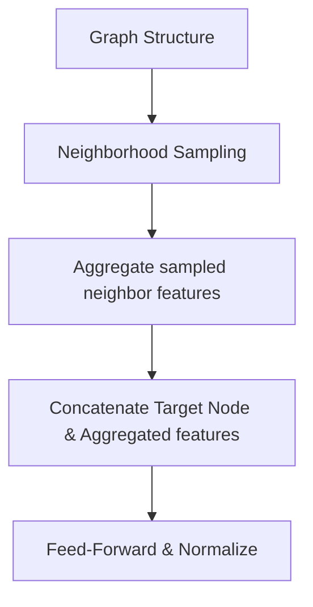

# GraphSAGE (Sample and Aggregate)

## Overview
Inductive mini-batch neighborhood pooling framework. Instead of reading an entire localized neighborhood matrix, it uniformly samples a fixed-capacity subset of neighbors at each layer step, running aggregation functions like Max-Pooling or LSTMs.

## Architecture Diagram

## Further Reading
- [Return to Main Index](../README.md)
