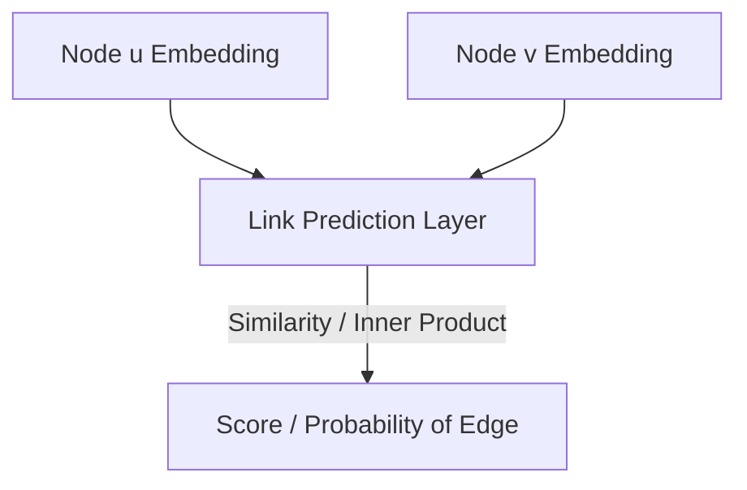

# Edge-Level Link Prediction

## Overview
Relationship forecasting. The network calculates a distance or similarity score between the hidden states of two separate nodes, predicting the likelihood that a connection exists or will form between them.

## Architecture Diagram

## Further Reading
- [Return to Main Index](../README.md)
