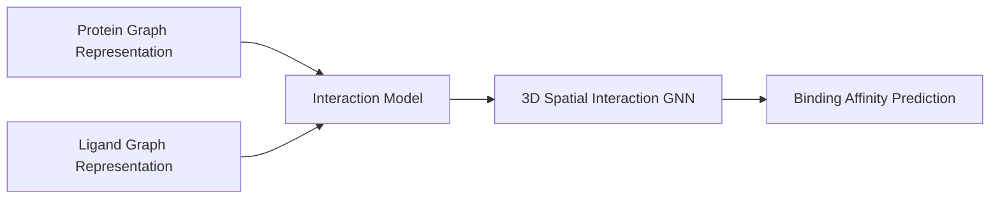

# De Novo Molecular Docking & Protein-Folding Synthesis

## Overview
Accelerates target-specific drug discovery loops. Models treat molecular chemical bonds natively as edge variables and atoms as node nodes. GNN layers parse 3D geometric configurations, optimizing properties to discover stable therapeutic compounds rapidly.

## Architecture Diagram

## Further Reading
- [Return to Main Index](../README.md)
