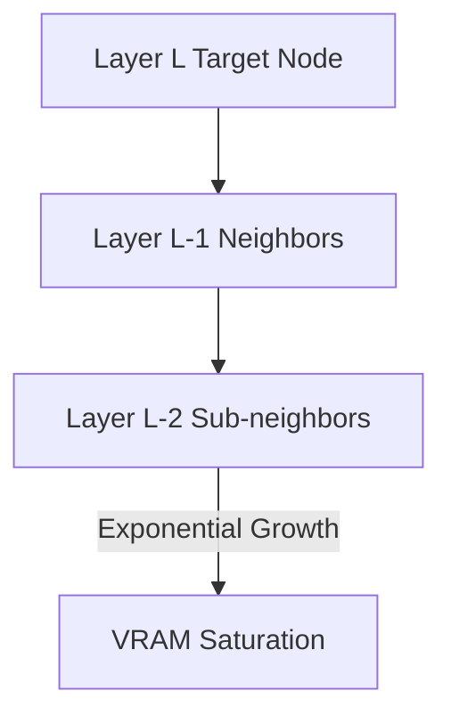

# The Neighborhood Explosion Memory Wall

## Overview
Because spatial message-passing cascades across successive layers, calculating gradients over a deep GNN forces the model to read an exponentially expanding tree of historical nodes (the neighborhood explosion). This quickly saturates VRAM during training.

## Architecture Diagram

## Further Reading
- [Return to Main Index](../README.md)
