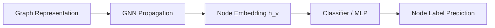

# Node-Level Classification

## Overview
Categorizing individual entities. The model evaluates a node's combined spatial features to predict its target class. A prime example is detecting fraudulent accounts or bot profiles within a social media connection web.

## Architecture Diagram

## Further Reading
- [Return to Main Index](../README.md)
