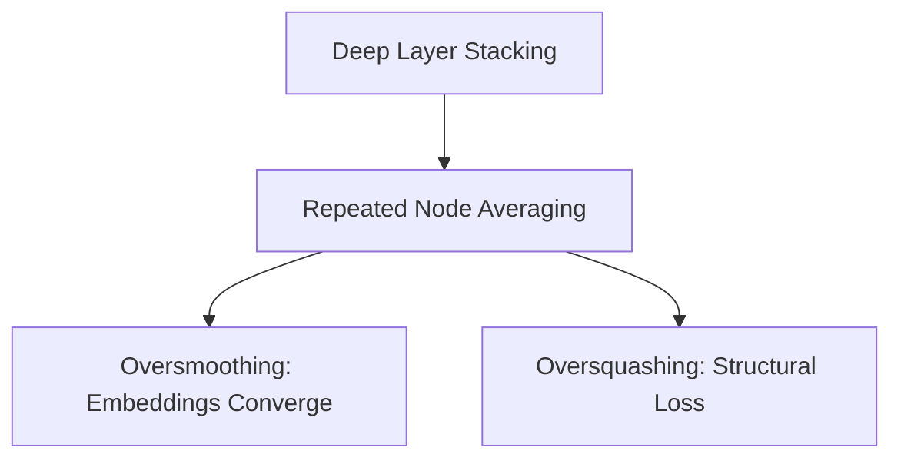

# The Oversmoothing and Oversquashing Stagnation

## Overview
When stacking standard spatial message-passing blocks, the constant averaging of neighbor parameters causes all node hidden vectors to converge on identical numerical states (Oversmoothing), or compresses global topological data into bottlenecked edges (Oversquashing).

## Architecture Diagram

## Further Reading
- [Return to Main Index](../README.md)
