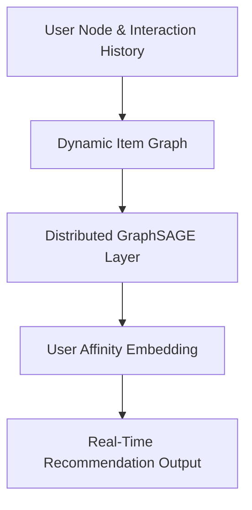

# Scale-Invariant E-Commerce Recommendation

## Overview
Powers high-volume consumer personalization arrays. Massive distributed GraphSAGE pipelines process user-interaction nodes, mapping real-time browse histories to dynamic item graphs to output accurate user affinity indices instantly.

## Architecture Diagram

## Further Reading
- [Return to Main Index](../README.md)
