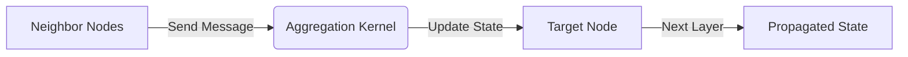

# The Spatial Message-Passing & Attention Era

## Overview
Resolved the scaling crisis by shifting convolutions straight onto the graph's physical space. Gilmer et al. unified this via Message Passing Neural Networks (MPNNs), framing updates as a three-step localized pipeline: Send Message, Aggregate, and Update Node Hidden State.

## Architecture Diagram

## Further Reading
- [Return to Main Index](../README.md)
