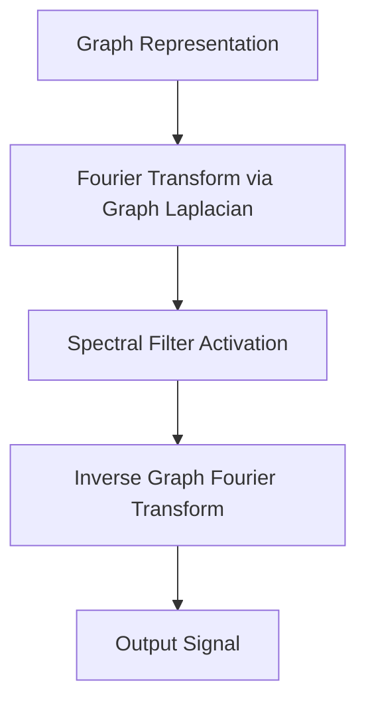

# The Spectral Domain Era

## Overview
Early GNNs defined graph convolutions by migrating to the spectral domain using the Graph Laplacian and Fourier transforms. Kipf and Welling modernized this with the Graph Convolutional Network (GCN, 2016), using a localized first-order Chebyshev polynomial approximation.

## Architecture Diagram

## Further Reading
- [Return to Main Index](../README.md)
